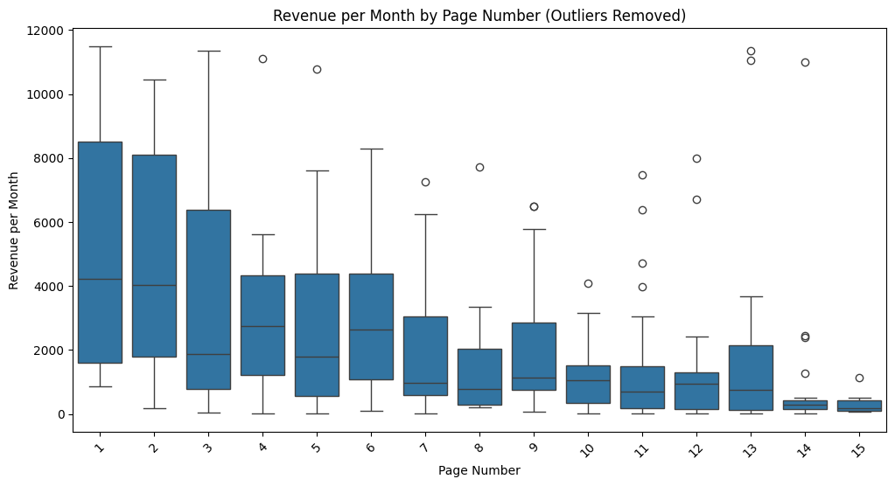
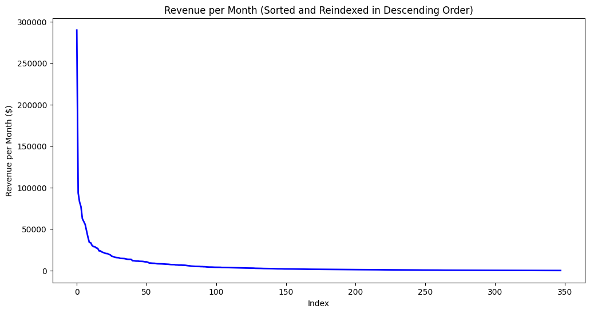
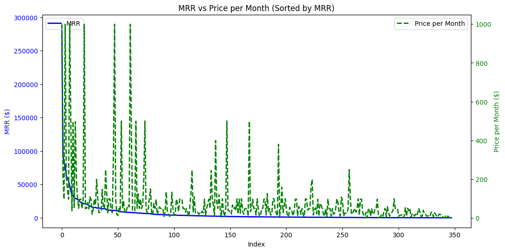
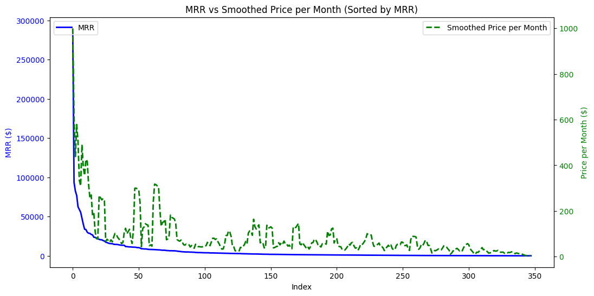
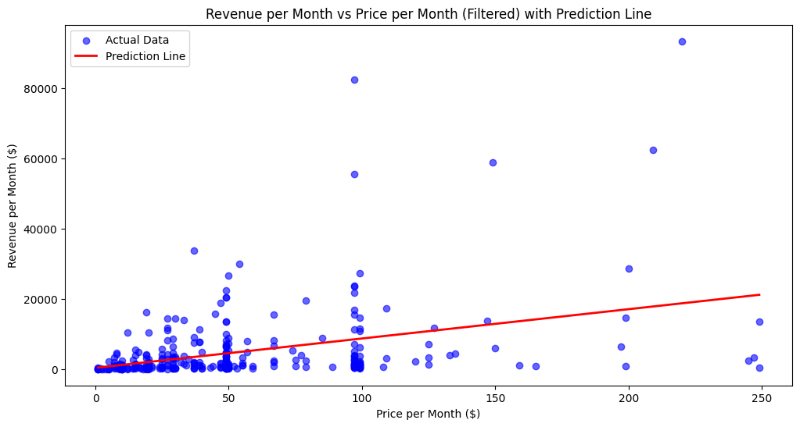
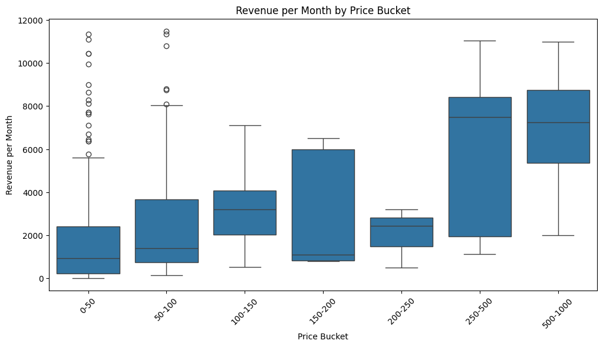
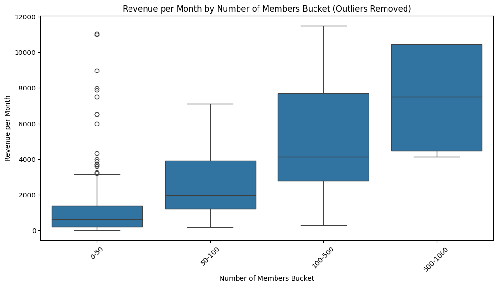

```python
import requests

for i in range(1, 35):
    url = f"https://www.skool.com/discovery?fl=paid&p={i}"
    response = requests.get(url)

    if response.status_code == 200:
        # Save the HTML content to a file
        with open(f"page_content_{i}.html", "w", encoding="utf-8") as file:
            file.write(response.text)
        print(f"HTML content saved to page_content_{i}.html")
    else:
        print("Failed to retrieve the page. Status code:", response.status_code)

```

    HTML content saved to page_content_1.html
    HTML content saved to page_content_2.html
    HTML content saved to page_content_3.html
    HTML content saved to page_content_4.html
    HTML content saved to page_content_5.html
    HTML content saved to page_content_6.html
    HTML content saved to page_content_7.html
    HTML content saved to page_content_8.html
    HTML content saved to page_content_9.html
    HTML content saved to page_content_10.html
    HTML content saved to page_content_11.html
    HTML content saved to page_content_12.html
    HTML content saved to page_content_13.html
    HTML content saved to page_content_14.html
    HTML content saved to page_content_15.html
    HTML content saved to page_content_16.html
    HTML content saved to page_content_17.html
    HTML content saved to page_content_18.html
    HTML content saved to page_content_19.html
    HTML content saved to page_content_20.html
    HTML content saved to page_content_21.html
    HTML content saved to page_content_22.html
    HTML content saved to page_content_23.html
    HTML content saved to page_content_24.html
    HTML content saved to page_content_25.html
    HTML content saved to page_content_26.html
    HTML content saved to page_content_27.html
    HTML content saved to page_content_28.html
    HTML content saved to page_content_29.html
    HTML content saved to page_content_30.html
    HTML content saved to page_content_31.html
    HTML content saved to page_content_32.html
    HTML content saved to page_content_33.html
    HTML content saved to page_content_34.html


```python
from bs4 import BeautifulSoup
import pandas as pd

data = []
# Load the HTML content
for i in range(1, 16):

    with open(f"tech/page_content_{i}.html", "r", encoding="utf-8") as file:
        soup = BeautifulSoup(file, "html.parser")

    # Locate all divs that match the structure provided
    cards = soup.find_all("div", class_="styled__DiscoveryCardContent-sc-13ysp3k-4")

    for card in cards:
        try:
            # Extract community name
            name = card.find("span", class_="styled__GroupNameWrapper-sc-dph3q3-0").text.strip()

            # Extract members and price per month
            meta_info = card.find("div", class_="styled__DiscoveryCardMeta-sc-13ysp3k-7").text
            meta_parts = meta_info.split(" • ")

            # Extract members count (convert to integer after removing "Members")
            members = int(meta_parts[1].replace("Members", "").strip())

            # Extract price per month (the third item containing "$")
            price_text = meta_parts[2]
            price = float(price_text.replace("$", "").replace("/month", "").strip())

            # Calculate revenue per month
            revenue = members * price

            # Append extracted data to the list
            data.append(
                {"Community Name": name, "Members": members, "Price per Month": price, "Revenue per Month": revenue, "Page Number": i}
            )

        except (AttributeError, ValueError, IndexError):
            # Handle cases where expected data is missing
            # print(f"Missing or malformed data in a card, skipping...")
            pass

# Create a DataFrame
df = pd.DataFrame(data)

# Display the DataFrame
display(df)
```


<div>
<style scoped>
    .dataframe tbody tr th:only-of-type {
        vertical-align: middle;
    }

    .dataframe tbody tr th {
        vertical-align: top;
    }

    .dataframe thead th {
        text-align: right;
    }
</style>
<table border="1" class="dataframe">
  <thead>
    <tr style="text-align: right;">
      <th></th>
      <th>Community Name</th>
      <th>Members</th>
      <th>Price per Month</th>
      <th>Revenue per Month</th>
      <th>Page Number</th>
    </tr>
  </thead>
  <tbody>
    <tr>
      <th>0</th>
      <td>Only AI</td>
      <td>456</td>
      <td>49.0</td>
      <td>22344.0</td>
      <td>1</td>
    </tr>
    <tr>
      <th>1</th>
      <td>KI Buch Club 🔥 ⭐⭐⭐⭐⭐</td>
      <td>243</td>
      <td>97.0</td>
      <td>23571.0</td>
      <td>1</td>
    </tr>
    <tr>
      <th>2</th>
      <td>IA Masters Automations</td>
      <td>557</td>
      <td>54.0</td>
      <td>30078.0</td>
      <td>1</td>
    </tr>
    <tr>
      <th>3</th>
      <td>AI Guy Academy</td>
      <td>534</td>
      <td>50.0</td>
      <td>26700.0</td>
      <td>1</td>
    </tr>
    <tr>
      <th>4</th>
      <td>Imperio Digital</td>
      <td>243</td>
      <td>37.0</td>
      <td>8991.0</td>
      <td>1</td>
    </tr>
    <tr>
      <th>...</th>
      <td>...</td>
      <td>...</td>
      <td>...</td>
      <td>...</td>
      <td>...</td>
    </tr>
    <tr>
      <th>343</th>
      <td>AI Growth Management Group</td>
      <td>10</td>
      <td>50.0</td>
      <td>500.0</td>
      <td>15</td>
    </tr>
    <tr>
      <th>344</th>
      <td>Tobi Wan Coaching</td>
      <td>3</td>
      <td>50.0</td>
      <td>150.0</td>
      <td>15</td>
    </tr>
    <tr>
      <th>345</th>
      <td>Circle of Trust</td>
      <td>4</td>
      <td>15.0</td>
      <td>60.0</td>
      <td>15</td>
    </tr>
    <tr>
      <th>346</th>
      <td>AI Risk &amp; Compliance Sandbox</td>
      <td>2</td>
      <td>49.0</td>
      <td>98.0</td>
      <td>15</td>
    </tr>
    <tr>
      <th>347</th>
      <td>Automatisation 101</td>
      <td>4</td>
      <td>49.0</td>
      <td>196.0</td>
      <td>15</td>
    </tr>
  </tbody>
</table>
<p>348 rows × 5 columns</p>
</div>


```python
summary = df.describe()
display(summary)
```


<div>
<style scoped>
    .dataframe tbody tr th:only-of-type {
        vertical-align: middle;
    }

    .dataframe tbody tr th {
        vertical-align: top;
    }

    .dataframe thead th {
        text-align: right;
    }
</style>
<table border="1" class="dataframe">
  <thead>
    <tr style="text-align: right;">
      <th></th>
      <th>Members</th>
      <th>Price per Month</th>
      <th>Revenue per Month</th>
      <th>Page Number</th>
    </tr>
  </thead>
  <tbody>
    <tr>
      <th>count</th>
      <td>348.000000</td>
      <td>348.000000</td>
      <td>348.000000</td>
      <td>348.000000</td>
    </tr>
    <tr>
      <th>mean</th>
      <td>95.681034</td>
      <td>81.965517</td>
      <td>6162.313218</td>
      <td>7.712644</td>
    </tr>
    <tr>
      <th>std</th>
      <td>146.975341</td>
      <td>149.875872</td>
      <td>18933.209236</td>
      <td>4.032742</td>
    </tr>
    <tr>
      <th>min</th>
      <td>2.000000</td>
      <td>1.000000</td>
      <td>8.000000</td>
      <td>1.000000</td>
    </tr>
    <tr>
      <th>25%</th>
      <td>12.000000</td>
      <td>20.000000</td>
      <td>443.250000</td>
      <td>4.000000</td>
    </tr>
    <tr>
      <th>50%</th>
      <td>33.000000</td>
      <td>48.000000</td>
      <td>1390.500000</td>
      <td>8.000000</td>
    </tr>
    <tr>
      <th>75%</th>
      <td>116.000000</td>
      <td>97.000000</td>
      <td>4906.500000</td>
      <td>11.000000</td>
    </tr>
    <tr>
      <th>max</th>
      <td>915.000000</td>
      <td>999.000000</td>
      <td>289710.000000</td>
      <td>15.000000</td>
    </tr>
  </tbody>
</table>
</div>


```python
import pandas as pd
import seaborn as sns
import matplotlib.pyplot as plt

# Assuming df is already created and has the "Revenue per Month" and "Page Number" columns

# Calculate Q1, Q3, and IQR for the "Revenue per Month" column
Q1 = df["Revenue per Month"].quantile(0.25)
Q3 = df["Revenue per Month"].quantile(0.75)
IQR = Q3 - Q1

# Define lower and upper bounds for outliers
lower_bound = Q1 - 1.5 * IQR
upper_bound = Q3 + 1.5 * IQR

# Filter out the outliers
df_filtered = df[(df["Revenue per Month"] >= lower_bound) & (df["Revenue per Month"] <= upper_bound)]

# Plotting without outliers
plt.figure(figsize=(12, 6))
sns.boxplot(x="Page Number", y="Revenue per Month", data=df_filtered)

# Adding titles and labels
plt.title("Revenue per Month by Page Number (Outliers Removed)")
plt.xlabel("Page Number")
plt.ylabel("Revenue per Month")
plt.xticks(rotation=45)

# Show the plot
plt.show()
```


    

    


```python
# Calculate Q1, Q3, and IQR for the "Revenue per Month" column
Q1 = df["Revenue per Month"].quantile(0.25)
Q3 = df["Revenue per Month"].quantile(0.75)
IQR = Q3 - Q1

# Define upper bound for high MRR outliers
upper_bound = Q3 + 1.5 * IQR

# Filter out high MRR outliers
high_mrr_outliers = df[df["Revenue per Month"] > upper_bound]

top_mrr = high_mrr_outliers.sort_values(by="Revenue per Month", ascending=False)

# Print the top 10 entries
display(top_mrr)
```


<div>
<style scoped>
    .dataframe tbody tr th:only-of-type {
        vertical-align: middle;
    }

    .dataframe tbody tr th {
        vertical-align: top;
    }

    .dataframe thead th {
        text-align: right;
    }
</style>
<table border="1" class="dataframe">
  <thead>
    <tr style="text-align: right;">
      <th></th>
      <th>Community Name</th>
      <th>Members</th>
      <th>Price per Month</th>
      <th>Revenue per Month</th>
      <th>Page Number</th>
    </tr>
  </thead>
  <tbody>
    <tr>
      <th>116</th>
      <td>Digital Renaissance (BETA)</td>
      <td>290</td>
      <td>999.0</td>
      <td>289710.0</td>
      <td>5</td>
    </tr>
    <tr>
      <th>10</th>
      <td>KI Club</td>
      <td>425</td>
      <td>220.0</td>
      <td>93500.0</td>
      <td>1</td>
    </tr>
    <tr>
      <th>5</th>
      <td>The AI Surfer Circle</td>
      <td>851</td>
      <td>97.0</td>
      <td>82547.0</td>
      <td>1</td>
    </tr>
    <tr>
      <th>82</th>
      <td>AIpreneurs (Premium)</td>
      <td>77</td>
      <td>999.0</td>
      <td>76923.0</td>
      <td>4</td>
    </tr>
    <tr>
      <th>34</th>
      <td>KI Creator Akademie</td>
      <td>299</td>
      <td>209.0</td>
      <td>62491.0</td>
      <td>2</td>
    </tr>
    <tr>
      <th>43</th>
      <td>KI @ Work Community</td>
      <td>396</td>
      <td>149.0</td>
      <td>59004.0</td>
      <td>3</td>
    </tr>
    <tr>
      <th>8</th>
      <td>New Society</td>
      <td>573</td>
      <td>97.0</td>
      <td>55581.0</td>
      <td>1</td>
    </tr>
    <tr>
      <th>243</th>
      <td>CPM* Private Community</td>
      <td>48</td>
      <td>999.0</td>
      <td>47952.0</td>
      <td>11</td>
    </tr>
    <tr>
      <th>148</th>
      <td>Speedrun To Promotion</td>
      <td>81</td>
      <td>497.0</td>
      <td>40257.0</td>
      <td>7</td>
    </tr>
    <tr>
      <th>27</th>
      <td>NATURAL 20</td>
      <td>915</td>
      <td>37.0</td>
      <td>33855.0</td>
      <td>2</td>
    </tr>
    <tr>
      <th>20</th>
      <td>Die KI-Masterclass …</td>
      <td>67</td>
      <td>499.0</td>
      <td>33433.0</td>
      <td>2</td>
    </tr>
    <tr>
      <th>2</th>
      <td>IA Masters Automations</td>
      <td>557</td>
      <td>54.0</td>
      <td>30078.0</td>
      <td>1</td>
    </tr>
    <tr>
      <th>325</th>
      <td>Automation Legends</td>
      <td>58</td>
      <td>497.0</td>
      <td>28826.0</td>
      <td>14</td>
    </tr>
    <tr>
      <th>74</th>
      <td>🚀 Spatial Collective 😎</td>
      <td>143</td>
      <td>200.0</td>
      <td>28600.0</td>
      <td>4</td>
    </tr>
    <tr>
      <th>167</th>
      <td>Cyber Freedom Fighters</td>
      <td>275</td>
      <td>99.0</td>
      <td>27225.0</td>
      <td>7</td>
    </tr>
    <tr>
      <th>3</th>
      <td>AI Guy Academy</td>
      <td>534</td>
      <td>50.0</td>
      <td>26700.0</td>
      <td>1</td>
    </tr>
    <tr>
      <th>62</th>
      <td>AI Automations Accelerators</td>
      <td>244</td>
      <td>97.0</td>
      <td>23668.0</td>
      <td>3</td>
    </tr>
    <tr>
      <th>1</th>
      <td>KI Buch Club 🔥 ⭐⭐⭐⭐⭐</td>
      <td>243</td>
      <td>97.0</td>
      <td>23571.0</td>
      <td>1</td>
    </tr>
    <tr>
      <th>0</th>
      <td>Only AI</td>
      <td>456</td>
      <td>49.0</td>
      <td>22344.0</td>
      <td>1</td>
    </tr>
    <tr>
      <th>25</th>
      <td>Millonario Ai</td>
      <td>224</td>
      <td>97.0</td>
      <td>21728.0</td>
      <td>2</td>
    </tr>
    <tr>
      <th>340</th>
      <td>Agexa Intelligence</td>
      <td>21</td>
      <td>999.0</td>
      <td>20979.0</td>
      <td>14</td>
    </tr>
    <tr>
      <th>6</th>
      <td>AI Foundations</td>
      <td>418</td>
      <td>49.0</td>
      <td>20482.0</td>
      <td>1</td>
    </tr>
    <tr>
      <th>143</th>
      <td>Make.com Airtable &amp; ChatGPT</td>
      <td>417</td>
      <td>49.0</td>
      <td>20433.0</td>
      <td>7</td>
    </tr>
    <tr>
      <th>57</th>
      <td>KI-CHAMPIONS Community</td>
      <td>246</td>
      <td>79.0</td>
      <td>19434.0</td>
      <td>3</td>
    </tr>
    <tr>
      <th>12</th>
      <td>KubeCraft - DevOps Community</td>
      <td>402</td>
      <td>47.0</td>
      <td>18894.0</td>
      <td>1</td>
    </tr>
    <tr>
      <th>31</th>
      <td>🚀 Indie App Accelerator</td>
      <td>159</td>
      <td>109.0</td>
      <td>17331.0</td>
      <td>2</td>
    </tr>
    <tr>
      <th>48</th>
      <td>Privacy Pros</td>
      <td>174</td>
      <td>97.0</td>
      <td>16878.0</td>
      <td>3</td>
    </tr>
    <tr>
      <th>114</th>
      <td>The No-Code Integrator</td>
      <td>849</td>
      <td>19.0</td>
      <td>16131.0</td>
      <td>5</td>
    </tr>
    <tr>
      <th>84</th>
      <td>Pivot2Tech</td>
      <td>349</td>
      <td>45.0</td>
      <td>15705.0</td>
      <td>4</td>
    </tr>
    <tr>
      <th>29</th>
      <td>The AI Playbook Premium</td>
      <td>160</td>
      <td>97.0</td>
      <td>15520.0</td>
      <td>2</td>
    </tr>
    <tr>
      <th>124</th>
      <td>PM Job Hunters United</td>
      <td>231</td>
      <td>67.0</td>
      <td>15477.0</td>
      <td>6</td>
    </tr>
    <tr>
      <th>134</th>
      <td>AI Automation by AInauten</td>
      <td>74</td>
      <td>199.0</td>
      <td>14726.0</td>
      <td>6</td>
    </tr>
    <tr>
      <th>92</th>
      <td>KI im Mittelstand</td>
      <td>147</td>
      <td>99.0</td>
      <td>14553.0</td>
      <td>4</td>
    </tr>
    <tr>
      <th>46</th>
      <td>Software Testing University</td>
      <td>537</td>
      <td>27.0</td>
      <td>14499.0</td>
      <td>3</td>
    </tr>
    <tr>
      <th>33</th>
      <td>AI Voice Pioneers</td>
      <td>480</td>
      <td>30.0</td>
      <td>14400.0</td>
      <td>2</td>
    </tr>
    <tr>
      <th>123</th>
      <td>Become a Quant: Finance/Energy</td>
      <td>425</td>
      <td>33.0</td>
      <td>14025.0</td>
      <td>6</td>
    </tr>
    <tr>
      <th>276</th>
      <td>Logic Room - UI Architecture</td>
      <td>93</td>
      <td>147.0</td>
      <td>13671.0</td>
      <td>12</td>
    </tr>
    <tr>
      <th>248</th>
      <td>AI Powered SEO</td>
      <td>276</td>
      <td>49.0</td>
      <td>13524.0</td>
      <td>11</td>
    </tr>
    <tr>
      <th>94</th>
      <td>AI Wealth Academy</td>
      <td>275</td>
      <td>49.0</td>
      <td>13475.0</td>
      <td>4</td>
    </tr>
    <tr>
      <th>236</th>
      <td>The Digital Delegator Masters</td>
      <td>54</td>
      <td>249.0</td>
      <td>13446.0</td>
      <td>10</td>
    </tr>
    <tr>
      <th>30</th>
      <td>The Survey School</td>
      <td>93</td>
      <td>127.0</td>
      <td>11811.0</td>
      <td>2</td>
    </tr>
    <tr>
      <th>64</th>
      <td>AI Builder Club</td>
      <td>436</td>
      <td>27.0</td>
      <td>11772.0</td>
      <td>3</td>
    </tr>
  </tbody>
</table>
</div>


```python
# Create a binary column to mark outliers (1 for outliers, 0 for non-outliers)
df["is_outlier"] = df["Revenue per Month"] > upper_bound

# Calculate correlation between 'Price per Month' and 'is_outlier'
correlation = df[["Price per Month", "is_outlier"]].corr()

# Print the correlation matrix
print("Correlation between Price per Month and Likelihood of Being an Outlier:")
print(correlation)
```

    Correlation between Price per Month and Likelihood of Being an Outlier:
                     Price per Month  is_outlier
    Price per Month         1.000000    0.311935
    is_outlier              0.311935    1.000000


```python
import matplotlib.pyplot as plt

# Sort the DataFrame by 'Revenue per Month' in descending order
df_sorted = df.sort_values(by="Revenue per Month", ascending=False)

# Reindex the DataFrame to have a sequential index
df_sorted_reset = df_sorted.reset_index(drop=True)

# Plotting Revenue per Month
plt.figure(figsize=(12, 6))
plt.plot(
    df_sorted_reset.index, df_sorted_reset["Revenue per Month"], label="Revenue per Month", color="blue", linewidth=2
)

# Adding titles and labels
plt.title("Revenue per Month (Sorted and Reindexed in Descending Order)")
plt.xlabel("Index")
plt.ylabel("Revenue per Month ($)")

# Show the plot
plt.show()
```


    

    


```python
import matplotlib.pyplot as plt
import pandas as pd

# Sort the DataFrame by 'Revenue per Month' (MRR) in descending order
df_sorted = df.sort_values(by="Revenue per Month", ascending=False)

# Reindex the DataFrame to have a sequential index
df_sorted = df_sorted.reset_index(drop=True)

# Apply a moving average to smooth the 'Price per Month' line
window_size = 5  # You can adjust this window size for more or less smoothing
df_sorted['Smoothed Price'] = df_sorted['Price per Month'].rolling(window=window_size, min_periods=1).mean()

# Create figure and axis
fig, ax1 = plt.subplots(figsize=(12, 6))

# Plot MRR on the first axis (left y-axis)
ax1.plot(df_sorted.index, df_sorted["Revenue per Month"], label="MRR", color="blue", linewidth=2)
ax1.set_xlabel("Index")
ax1.set_ylabel("MRR ($)", color="blue")
ax1.tick_params(axis="y", labelcolor="blue")

# Create a second y-axis for Smoothed Price per Month
ax2 = ax1.twinx()
ax2.plot(
    df_sorted.index, df_sorted["Smoothed Price"], label="Smoothed Price per Month", color="green", linestyle="--", linewidth=2
)
ax2.set_ylabel("Price per Month ($)", color="green")
ax2.tick_params(axis="y", labelcolor="green")

# Adding titles and a legend
plt.title("MRR vs Smoothed Price per Month (Sorted by MRR)")
ax1.legend(loc="upper left")
ax2.legend(loc="upper right")

# Show the plot
plt.show()

```


    

    


```python
import matplotlib.pyplot as plt
import pandas as pd

# Sort the DataFrame by 'Revenue per Month' (MRR) in descending order
df_sorted = df.sort_values(by="Revenue per Month", ascending=False)

# Reindex the DataFrame to have a sequential index
df_sorted = df_sorted.reset_index(drop=True)

# Apply a moving average to smooth the 'Price per Month' line
window_size = 5  # You can adjust this window size for more or less smoothing
df_sorted["Smoothed Price"] = df_sorted["Price per Month"].rolling(window=window_size, min_periods=1).mean()

# Create figure and axis
fig, ax1 = plt.subplots(figsize=(12, 6))

# Plot MRR on the first axis (left y-axis)
ax1.plot(df_sorted.index, df_sorted["Revenue per Month"], label="MRR", color="blue", linewidth=2)
ax1.set_xlabel("Index")
ax1.set_ylabel("MRR ($)", color="blue")
ax1.tick_params(axis="y", labelcolor="blue")

# Create a second y-axis for Smoothed Price per Month
ax2 = ax1.twinx()
ax2.plot(
    df_sorted.index,
    df_sorted["Smoothed Price"],
    label="Smoothed Price per Month",
    color="green",
    linestyle="--",
    linewidth=2,
)
ax2.set_ylabel("Price per Month ($)", color="green")
ax2.tick_params(axis="y", labelcolor="green")

# Adding titles and a legend
plt.title("MRR vs Smoothed Price per Month (Sorted by MRR)")
ax1.legend(loc="upper left")
ax2.legend(loc="upper right")

# Show the plot
plt.show()
```


    

    


```python
display(df[df["Price per Month"] > 500].sort_values(by="Revenue per Month", ascending=False))
```


<div>
<style scoped>
    .dataframe tbody tr th:only-of-type {
        vertical-align: middle;
    }

    .dataframe tbody tr th {
        vertical-align: top;
    }

    .dataframe thead th {
        text-align: right;
    }
</style>
<table border="1" class="dataframe">
  <thead>
    <tr style="text-align: right;">
      <th></th>
      <th>Community Name</th>
      <th>Members</th>
      <th>Price per Month</th>
      <th>Revenue per Month</th>
      <th>Page Number</th>
    </tr>
  </thead>
  <tbody>
    <tr>
      <th>116</th>
      <td>Digital Renaissance (BETA)</td>
      <td>290</td>
      <td>999.0</td>
      <td>289710.0</td>
      <td>5</td>
    </tr>
    <tr>
      <th>82</th>
      <td>AIpreneurs (Premium)</td>
      <td>77</td>
      <td>999.0</td>
      <td>76923.0</td>
      <td>4</td>
    </tr>
    <tr>
      <th>243</th>
      <td>CPM* Private Community</td>
      <td>48</td>
      <td>999.0</td>
      <td>47952.0</td>
      <td>11</td>
    </tr>
    <tr>
      <th>340</th>
      <td>Agexa Intelligence</td>
      <td>21</td>
      <td>999.0</td>
      <td>20979.0</td>
      <td>14</td>
    </tr>
    <tr>
      <th>338</th>
      <td>British Royal Yacht Club</td>
      <td>11</td>
      <td>999.0</td>
      <td>10989.0</td>
      <td>14</td>
    </tr>
    <tr>
      <th>293</th>
      <td>THE DIRT CREW</td>
      <td>8</td>
      <td>999.0</td>
      <td>7992.0</td>
      <td>12</td>
    </tr>
  </tbody>
</table>
</div>


```python
import matplotlib.pyplot as plt
from sklearn.linear_model import LinearRegression
import numpy as np

# Filter the DataFrame to only include prices below or equal to $250
df_filtered = df[df["Price per Month"] <= 250]

# Extract the features and target variable
X = df_filtered["Price per Month"].values.reshape(-1, 1)  # Feature (Price per Month)
y = df_filtered["Revenue per Month"].values  # Target (Revenue per Month)

# Create and fit the linear regression model
model = LinearRegression()
model.fit(X, y)

# Generate predictions across the range of filtered price values
X_range = np.linspace(X.min(), X.max(), 100).reshape(-1, 1)
y_pred = model.predict(X_range)

# Plotting the scatterplot of the filtered data
plt.figure(figsize=(12, 6))
plt.scatter(
    df_filtered["Price per Month"], df_filtered["Revenue per Month"], color="blue", label="Actual Data", alpha=0.6
)

# Plotting the regression line
plt.plot(X_range, y_pred, color="red", linewidth=2, label="Prediction Line")

# Adding labels and title
plt.title("Revenue per Month vs Price per Month (Filtered) with Prediction Line")
plt.xlabel("Price per Month ($)")
plt.ylabel("Revenue per Month ($)")
plt.legend()

# Show the plot
plt.show()
```


    

    


```python
import pandas as pd
import seaborn as sns
import matplotlib.pyplot as plt

# Assuming df is already created and has the "Revenue per Month" column

# Define the price per month buckets
bins = [0, 50, 100, 150, 200, 250, 500, 1000]  # Adjust the ranges as needed
labels = ["0-50", "50-100", "100-150", "150-200", "200-250", "250-500", "500-1000"]
df["Price Bucket"] = pd.cut(df["Price per Month"], bins=bins, labels=labels, right=False)

# Calculate Q1, Q3, and IQR for the "Revenue per Month" column
Q1 = df["Revenue per Month"].quantile(0.25)
Q3 = df["Revenue per Month"].quantile(0.75)
IQR = Q3 - Q1

# Define lower and upper bounds for outliers
lower_bound = Q1 - 1.5 * IQR
upper_bound = Q3 + 1.5 * IQR

# Filter out the outliers
df_filtered = df[(df["Revenue per Month"] >= lower_bound) & (df["Revenue per Month"] <= upper_bound)]

# Plotting without outliers
plt.figure(figsize=(12, 6))
sns.boxplot(x="Price Bucket", y="Revenue per Month", data=df_filtered, order=labels)

# Adding titles and labels
plt.title("Revenue per Month by Price Bucket")
plt.xlabel("Price Bucket")
plt.ylabel("Revenue per Month")
plt.xticks(rotation=45)

# Show the plot
plt.show()
```


    

    


```python
import pandas as pd
import seaborn as sns
import matplotlib.pyplot as plt

# Assuming df is already created and has the "Revenue per Month" and "Number of Members" columns

# Define the number of members buckets
member_bins = [0, 50, 100, 500, 1000]  # Adjust the ranges as needed
member_labels = ["0-50", "50-100", "100-500", "500-1000"]
df["Member Bucket"] = pd.cut(df["Members"], bins=member_bins, labels=member_labels, right=False)

# Calculate Q1, Q3, and IQR for the "Revenue per Month" column
Q1 = df["Revenue per Month"].quantile(0.25)
Q3 = df["Revenue per Month"].quantile(0.75)
IQR = Q3 - Q1

# Define lower and upper bounds for outliers
lower_bound = Q1 - 1.5 * IQR
upper_bound = Q3 + 1.5 * IQR

# Filter out the outliers
df_filtered = df[(df["Revenue per Month"] >= lower_bound) & (df["Revenue per Month"] <= upper_bound)]

# Plotting without outliers
plt.figure(figsize=(12, 6))
sns.boxplot(x="Member Bucket", y="Revenue per Month", data=df_filtered, order=member_labels)

# Adding titles and labels
plt.title("Revenue per Month by Number of Members Bucket (Outliers Removed)")
plt.xlabel("Number of Members Bucket")
plt.ylabel("Revenue per Month")
plt.xticks(rotation=45)

# Show the plot
plt.show()
```


    

    


```python

```
